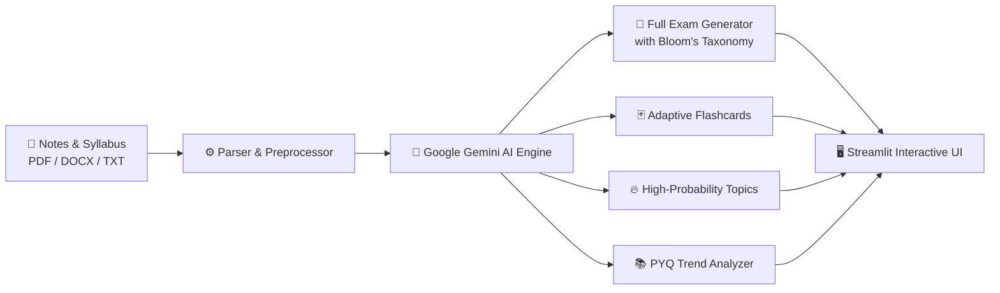

# ⚡ ExamForge AI — Final Prep Platform

[](requirements.txt)
[](https://streamlit.io/)
[](https://aistudio.google.com/)
[](LICENSE)

**ExamForge AI** is an intelligent, AI-powered exam preparation and revision platform built with **Streamlit** and **Google Gemini AI**. It transforms raw syllabus documents, notes, and past question patterns into comprehensive exam papers, adaptive flashcards, high-probability topic predictions, and timed practice tests.

---

## 🔄 Architecture & Workflow



---

## 🌟 Key Features

| Feature | Capability |
|---|---|
| 📁 **Smart Syllabus Ingestion** | Extracts and indexes content from PDF, DOCX, and TXT files using multi-format parsers. |
| 📄 **Exam Generator** | Produces full mock papers with dynamic answer keys, marking schemes, and Bloom's cognitive level tags. |
| 🗂️ **Curated Question Bank** | Auto-generates high-yield sample questions separated into conceptual and application-based tiers. |
| 🃏 **Active Recall Flashcards** | Interactive flip-card revision system for rapid retention of core formulas and definitions. |
| ⏱️ **Timed Exam Simulation** | Real-time countdown timer mode simulating high-pressure exam environments. |
| 📚 **PYQ Pattern Analyzer** | Analyzes university-specific past exam trends to pinpoint recurring question themes. |
| 🔥 **Important Topic Predictor** | Uses Gemini reasoning to evaluate topic weightage and identify critical revision focus areas. |
| 📈 **Cognitive Analytics** | Visual breakdowns of difficulty levels, question type distribution, and Bloom's taxonomy balance. |

---

## 🚀 Quick Start Guide

### 1. Clone the Repository
```bash
git clone https://github.com/rajdeep-r24/AI-Study-Helper.git
cd AI-Study-Helper
```

### 2. Install Dependencies
```bash
pip install -r requirements.txt
```

### 3. Configure Gemini API Key
- Get a free API key from [Google AI Studio](https://aistudio.google.com/app/apikey).
- You can provide the key directly in the web application's secure sidebar at runtime.

### 4. Launch the Application
```bash
streamlit run app.py
```

---

## 💡 How to Use

1. **API Key Setup**: Enter your Gemini API key in the sidebar.
2. **Configure Context**: Input your University name, Subject, and Topic of study.
3. **Upload Materials**: Upload course notes or reference materials (PDF, DOCX, or TXT) in the **Upload Notes** tab.
4. **Generate Revision Assets**:
   - Navigate to **🔥 Imp Topics** and click *Extract Important Topics*.
   - Navigate to **🃏 Flashcards** to generate interactive concept cards.
   - Navigate to **🗂️ Question Bank** to populate sample and expected questions.
5. **Simulate Exams**: Go to **📄 Exam Generator** to generate customized mock tests and practice under timed conditions in **⏱️ Timed Practice**.
6. **Export & Download**: Export generated papers and question banks in structured JSON or clean text formats for offline review.

---

## 🎨 UI & Design Aesthetics

- **Futuristic Dark Palette**: Deep space background with glowing electric indigo and cyan accents.
- **Modern Typography**: Heading hierarchy styled with *Syne*, body text with *Outfit*, and data labels with *DM Mono*.
- **Micro-Animations**: Shimmer gradients, hover-reactive cards, and real-time interactive widgets.

---

## 🛠️ Tech Stack

- **Core Engine**: Python 3.9+
- **Frontend / Interface**: Streamlit with custom CSS design system
- **Generative AI Model**: Google Gemini API (`gemini-1.5-flash`)
- **Document Processing**: `PyPDF2`, `python-docx`

---

## 📄 License

This project is licensed under the [MIT License](LICENSE).
